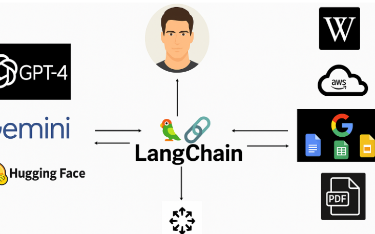
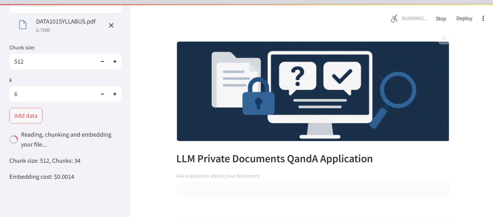
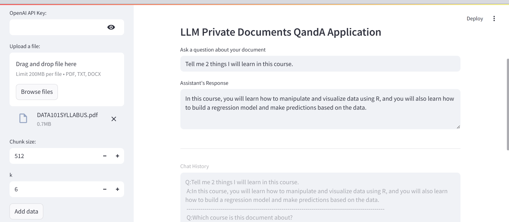
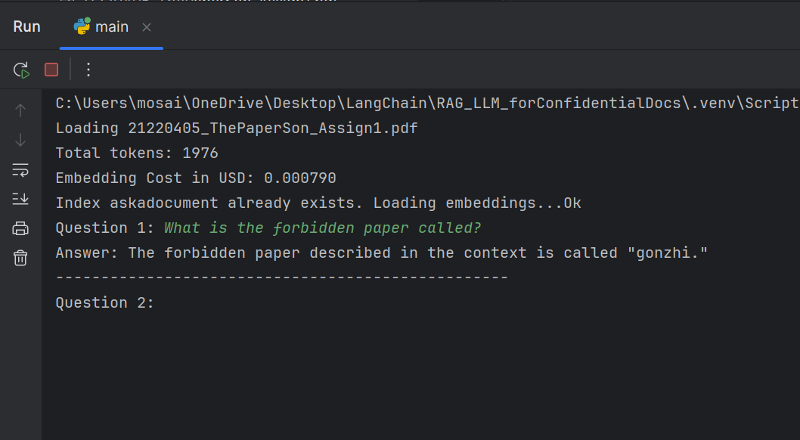

---





---

# 📄 Ask a Document with LangChain, OpenAI & Pinecone

This project allows you to upload a document (PDF or DOCX), convert it into vector embeddings using OpenAI, store it in Pinecone, and ask natural language questions about it using a conversational chain powered by LangChain.

---

## 🛠 Requirements

Install the necessary dependencies:

```bash
pip install openai langchain langchain-openai langchain-community langchain-pinecone pinecone-client python-dotenv tiktoken pypdf2 docx2txt
```

---

## 📂 Environment Setup

Create a `.env` file in the root directory with:

```ini
OPENAI_API_KEY=your_openai_api_key
PINECONE_API_KEY=your_pinecone_api_key
```

---

## ⚙️ How It Works

### 1. Load the Document

Supports `.pdf` and `.docx` files.

```python
data = load_document("my_file.pdf")
```

### 2. Chunk the Text

Split the text into smaller pieces to embed them efficiently.

```python
chunks = chunk_data(data)
```

### 3. Check Embedding Cost

```python
print_embedding_costs(chunks)
```

### 4. Create or Load Pinecone Index

```python
vector_store = insert_or_fetch_embeddings("askadocument", chunks)
```

### 5. Start the QA Chat Loop

```python
runLoop(vector_store)
```

Ask any question about your document. Type `quit` or `bye` to exit.

---

## 🧼 (Optional) Delete Pinecone Index

```python
delete_pinecone_index("askadocument")  # or use "all"
```

---

## 🧠 Notes

- Embedding model: `text-embedding-3-small` (1536 dimensions)
- LLM used: `gpt-3.5-turbo` via LangChain's `ConversationalRetrievalChain`
- Tokens are counted using `tiktoken` to estimate embedding cost

---

## 📝 Project File Structure

```bash
project/
├── .env
├── ask_document.py
├── 21220405_ThePaperSon_Assign1.pdf
├── README.md
```

---

## 💡 Example Interaction




## ⚡ Credits

- LangChain  
- OpenAI  
- Pinecone
